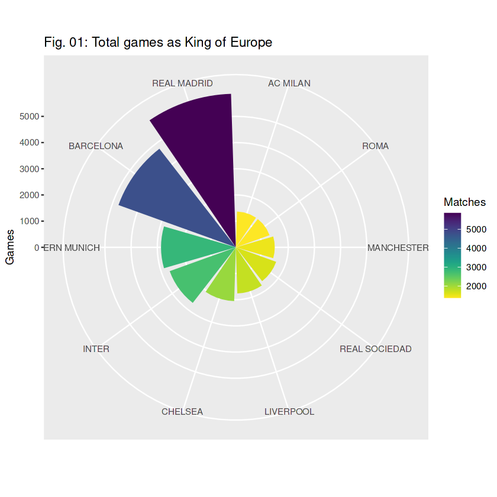
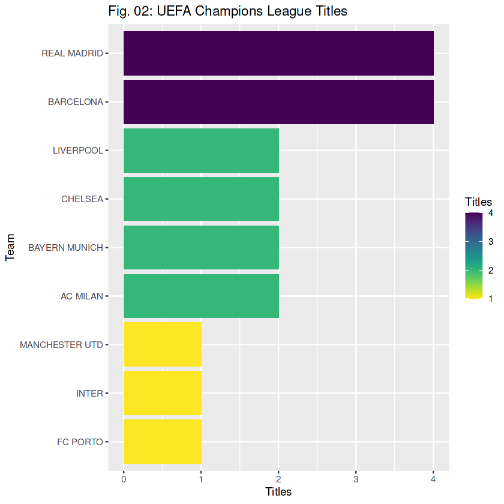
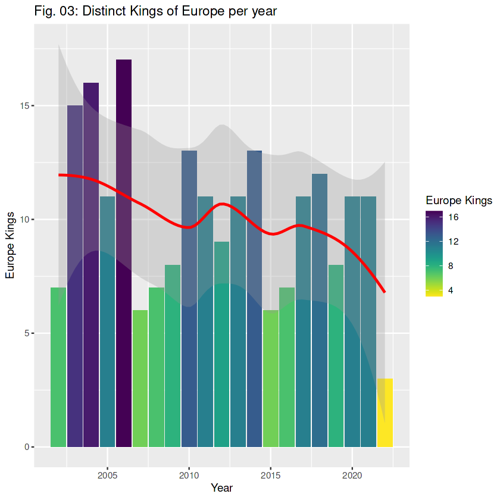
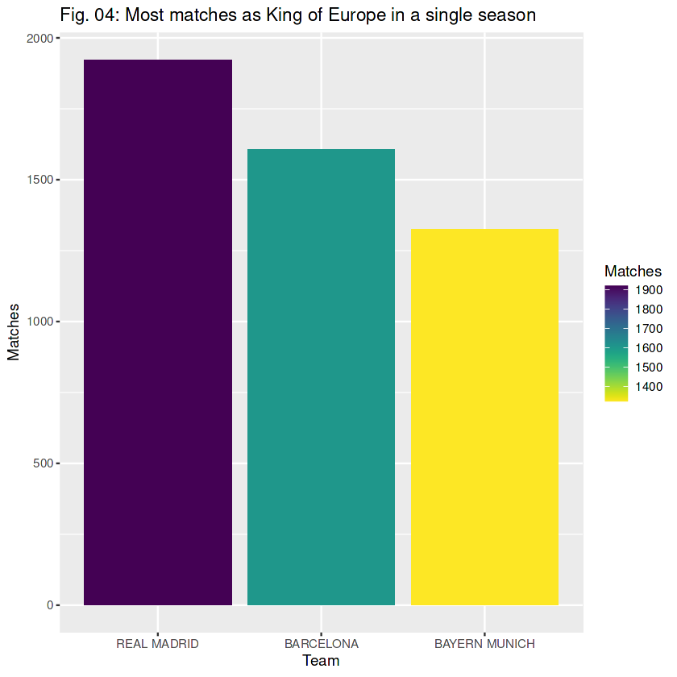
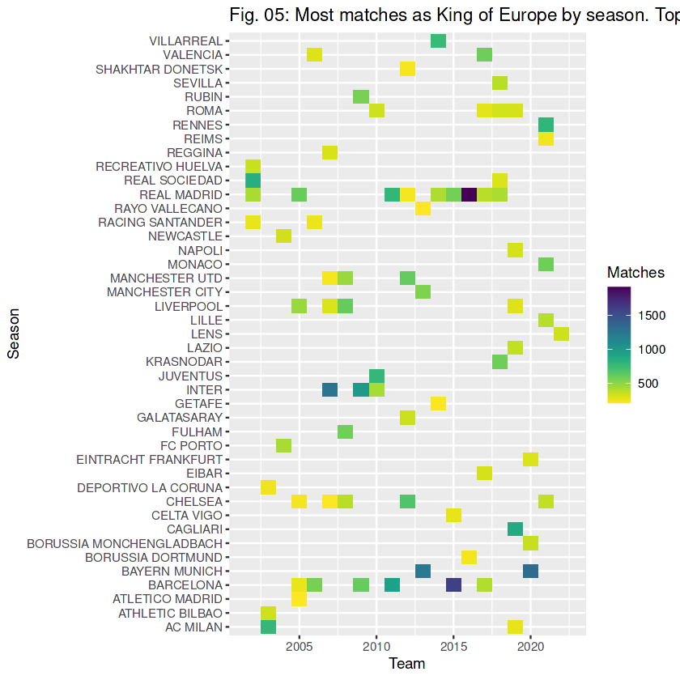
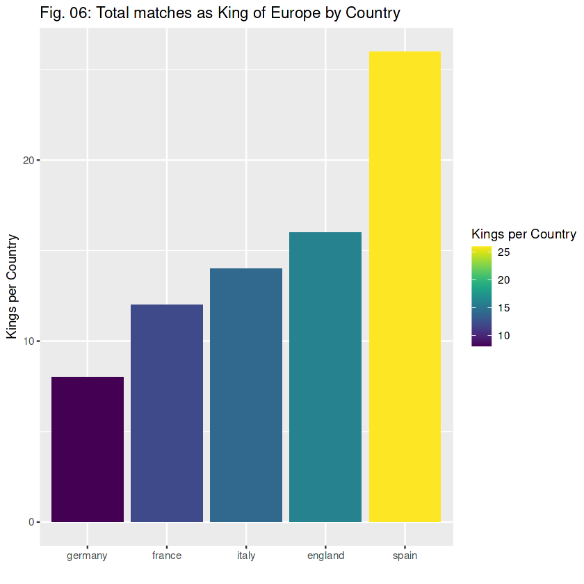
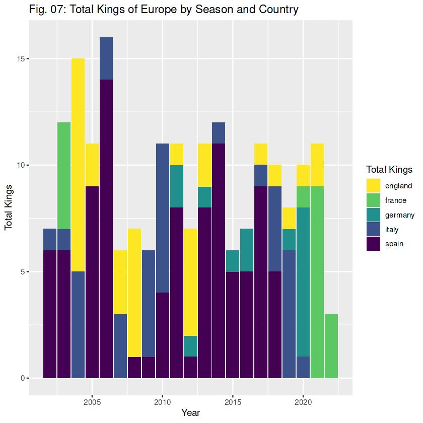

# Objetivo del proyecto

El objetivo es cambiar las reglas del campeón de europa para establecer las normas del boxeo, quien gane al campeón es el actual 'Rey de Europa' y así conocer quién es en cada momento, quién lo ha sido más y cuando lo ha sido y hacer las estadísticas de partidos como campeón de cada equipo y país.

# Origen de los datos

Todos los datos necesarios están subidos en un repositorio de Kaggle (https://www.kaggle.com/datasets/willfitzhugh/european-soccer-data) Datos de 2002 a oct/2022

# Programas y paquetes

Todo el análisis en R, paquetes principales: tidyverse, dplyr, tidyr, ggplot2, lubridate forcats y viridis.

# Procesos realizados

1. Limpieza de datos (nulls y cambios de formato)
2. Creación de columna de campeón con condicional autoreferencial
3. Creación de gráficos por equipos
4. Cálculo del país por mayoría de partidos de cada equipo y gráficos por país

# Resultado del análisis

## Campeón actual: LILLE (FR) [18/10/2022]
## Más partidos como 'Rey de Europa' y más campeones de Champions:
 

## 'Reyes de Europa' por temporada:

## Más partidos como campeón de europa y temporada:
 

## Reyes por país y temporada:
 

# Lecciones aprendidas y recomendaciones

1. Formular un condicional con autoreferencia
2. Visualización de datos de nuevas formas (ggplot)
3. Formular una columna en base a valor más repetido (str) para calcular país sin otra tabla de referencia

# Limitaciones y qué puede ser mejorado

Este dataset me ha encantado, me ha costado mucho porque la elaboración para saber si el 'Rey de Europa' juega y, si juega comparar para saber si ha ganado o no, me ha parecido bastante difícil y he inverido bastantes horas, aunque ha merecido la pena. También estoy muy orgulloso de haber conseguido el país de cada uno sin tener que añadir otra tabla a mano. Me encantan los datos de deportes e intentar llevar sistemas de puntuación o clasificación a otros, puedo sacarle aún mucho juego a este dataset como saber cuándo pierden los campeones, contra quién (matagigantes) y quién consigue mayor racha sin perder, ya que en este dataset se cuentan todos los partidos (ya que en todos parte como campeón pero no en todos juega)
